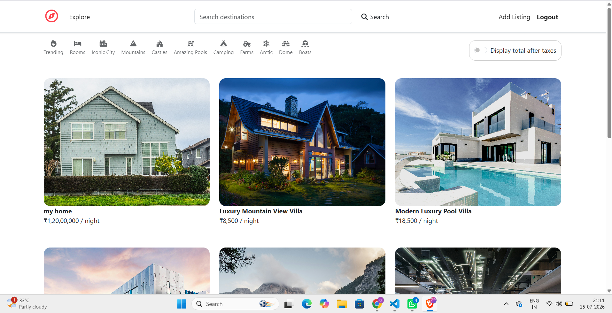
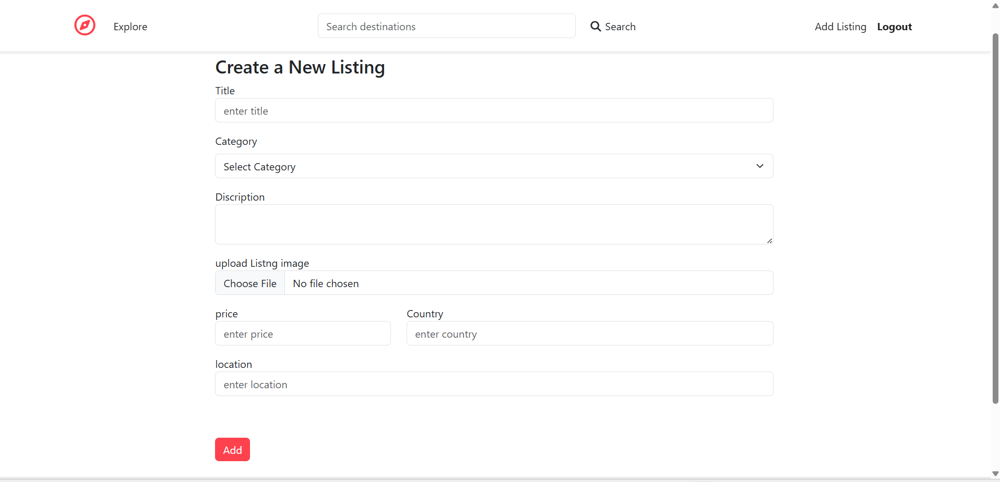
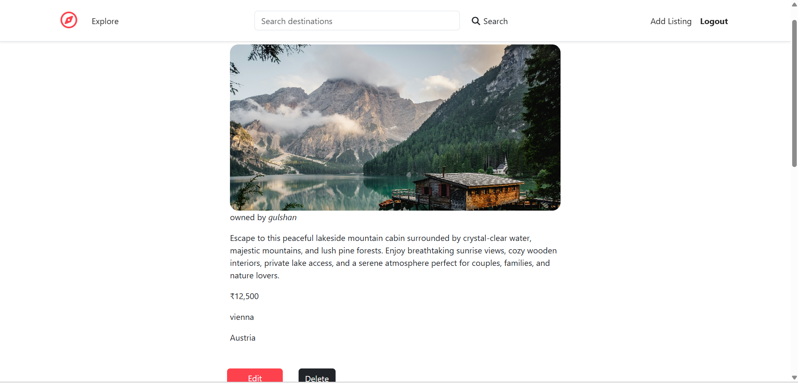
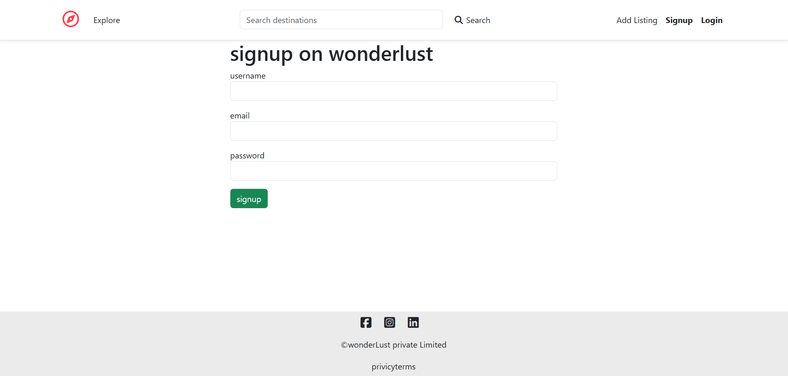

# 🌍 Wonderlust

<p align="center">
  <h3 align="center">Airbnb Inspired Travel Listing Platform</h3>
  <p align="center">
    A full-stack travel listing web application where users can explore, create, edit, and manage beautiful travel destinations.
  </p>
</p>

<p align="center">

[](https://wonderlust-lin0.onrender.com)


</p>

---

# 🌐 Live Website

### 🚀 https://wonderlust-lin0.onrender.com

---

# 📸 Project Screenshots

## 🏠 Home Page



---

## ➕ Add New Listing



---

## 📍 Listing Details



---

## 🔐 Signup Page



---

# ✨ Features

- 🔐 Secure User Authentication (Signup/Login/Logout)
- 🏡 Create, Edit & Delete Listings
- 📷 Upload Property Images
- ⭐ Reviews & Ratings
- 🔍 Search Destinations
- 🗂️ Category Filtering
- 💰 Price Display
- 📱 Fully Responsive Design
- ☁️ MongoDB Atlas Database
- 🌍 Cloudinary Image Storage

---

# 🛠 Tech Stack

## Frontend

- HTML5
- CSS3
- Bootstrap
- JavaScript
- EJS

## Backend

- Node.js
- Express.js

## Database

- MongoDB Atlas
- Mongoose

## Authentication

- Passport.js
- Express Session

## Image Storage

- Cloudinary
- Multer

---

# 📂 Folder Structure

```text
Wonderlust/
│
├── controller/
├── init/
├── models/
├── public/
├── routes/
├── uploads/
├── utils/
├── views/
│
├── app.js
├── package.json
├── cloudConfig.js
├── schema.js
└── README.md
```

---

# ⚙ Installation

### Clone Repository

```bash
git clone https://github.com/GULSHANYADAV-04/Wonderlust.git
```

### Go to Project

```bash
cd Wonderlust
```

### Install Dependencies

```bash
npm install
```

### Start Server

```bash
node app.js
```

or

```bash
nodemon app.js
```

---

# 🔑 Environment Variables

Create a `.env` file and add

```env
ATLASDB_URL=your_mongodb_connection_string

SECRET=your_secret_key

CLOUD_NAME=your_cloudinary_name

CLOUD_API_KEY=your_cloudinary_api_key

CLOUD_API_SECRET=your_cloudinary_api_secret
```

---

# 🚀 Future Improvements

- ❤️ Wishlist Feature
- 🗺 Google Maps Integration
- 💳 Online Booking
- 🔔 Notifications
- 📱 Mobile Application
- 🌍 Multi-language Support

---

# 👨‍💻 Author

## Gulshan Yadav

- GitHub: https://github.com/GULSHANYADAV-04

---

# ⭐ Support

If you like this project, please consider giving it a ⭐ on GitHub.

It motivates me to build more awesome projects.

---

<p align="center">

### ❤️ Thank you for visiting Wonderlust ❤️

</p>
